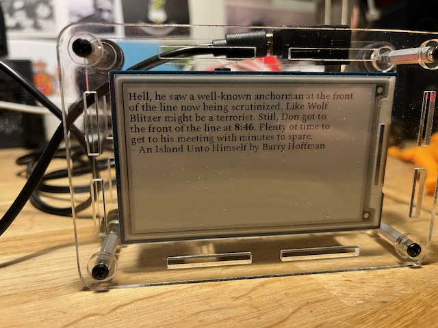
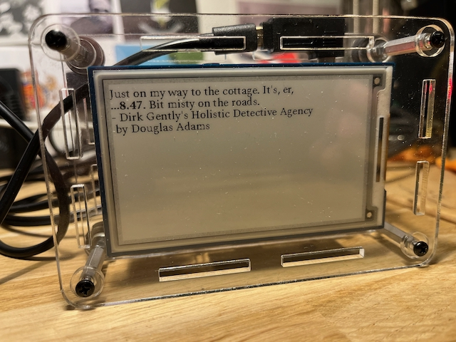
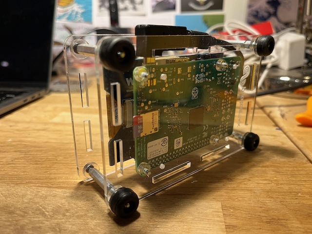

# literature-clock-epaper

Raspberry Pi powered e-Paper display clock. Every minute a passage from a book is shown mentioning the current time. Over 4500 quotes in the database.





## Hardware
This code has been designed, developed, and tested to run on a Raspberry Pi 3 Model B+ with a Waveshare 3.7" e-Paper display hat. The Raspberry Pi can be easily swapped for a different model, but changes to the display will need to be reflected in the code.

I house the system in a Protostax clear acrylic enclosure. I needed to drill new holes in the acrylic to seat the Pi centrally in the enclosure.

I **strongly** recommend an official Raspberry Pi power supply as they can become unstable with others.

### Raspberry Pi 3 Model B+
https://www.raspberrypi.com/products/raspberry-pi-3-model-b/

### Waveshare e-Paper 3.7" display hat
https://www.waveshare.com/wiki/3.7inch_e-Paper_HAT_Manual

### Protostax enclosure
https://www.protostax.com/products/protostax-for-raspberry-pi-b

## Software

### Installation

These instructions assume you have a Linux type work station to work from with ssh access to your Raspberry Pi.

* Git clone this repository onto your work station

#### Raspberry Pi preparation
Assuming a recent install of Raspberry Pi OS, 'Lite' version recommended as no desktop is necessary:
* Ensure functioning wired or WiFi network on the Pi for access and so that NTP will keep the system clock accurate.
* Enable SPI on the Raspberry Pi by adding/uncommenting the following line:
```
dtparam=spi=on
```
in the file:
```
/boot/firmware/config.txt
```
* Update packages on Pi:
```
sudo apt update
sudo apt upgrade -y
```
* Reboot after upgrades and SPI enabling
* Install required packages:
```
sudo apt install ntp -y
sudo apt install python3-pil -y
```
#### Application installation
* Edit the following `systemd` service file and modify the path to the application for your particular install:
```
literature-clock-epaper/src/literature-clock-epaper.service
```
* Install application from this git repo :
```
cd literature-clock-epaper/
tools/install-on-pi.sh -d <install path on Raspberry Pi> -i <IP address of Raspberry Pi> -u <user to ssh to on Raspberry Pi>
```
* Install `systemd` service
```
ssh <user>@<Raspberry Pi IP>
cd <install directory>
./install-systemd-script.sh
```
The application should start now, and you should see quotes appearing on the screen every minute.
### CSV file format
Although the application itself reads it's quotes from a SQLight database (`data/quotes.db`), the master source for the quotes remains a CSV file for convenience and to make it easier to import and exchange quotes from other sources. A tool is provided in this repository to convert the CSV quotes file to an SQLight database for the application - `tools/csv-to-sqlight.py`.
#### Fields
`| Time | Quote time | Quote | Title | Author | SFW |`

Unlike other similar projects, literature-clock-epaper does not need or support a title row.
#### Forced line breaks
Add a `<br>` in the `Quote` field text to force a line break on the display.
### Tools for managing CSV files and SQLight DB
https://github.com/alexdyas/literature-clock-epaper/tree/main/tools
## Behaviour
### Pause on startup
The system will pause for 30 seconds (systemd service) to allow for WiFi to settle down to be able to display the WiFi details on the startup info screen. Edit the systemd service accordingly if you don't need this.
### Longer quotes
Quotes that are longer than 13 lines at 20pt normal font will be displayed in a smaller 16pt font to fit on the screen.

## Command line parameters
The main executable (`literature-clock-epaper.py`) has the following command line parameters:
| Option | Description | Optional / Mandatory | Default |
| - | - | - | - |
| `--debug` | Print debug messages on terminal during opration | Optional | Off |
| `--disableinfo` | Disable display of system info on startup | Optional | Off |
| `--flip` | Flip screen horizontally and vertically | Optional | Off |
| `--help` | Print usage help | Optional | - |
| `--logfile <filename>` | Log to a file instead of the default STDOUT | Optional | STDOUT |
| `--oneofftime <HH:MM>` | Run once for specified hour/minute. For debugging | Optional | Off |
| `--sqlightdbfile <path to db file>` | Specify alternate path to Sqlight DB file | Optional | `data/quotes.db` |

## systemd service
See

`src/literature-clock-epaper.service`

and

`src/install-systemd-script.sh`

## Testing
`test.csv`   - Test csv file
`test.db`    - Test database
### Test records
* `00:00` Very long record
* `01:00` Short record, long title
* `02:00` Very short record
### Launch with test records
```
./literature-clock-epaper.py --sqlightdbfile data/test.db --oneofftime 01:00
```
## Further reading
### e-Paper screen
https://www.waveshare.com/wiki/3.7inch_e-Paper_HAT_Manual#Working_With_Raspberry_Pi
### Python Pillow (PIL) library
https://pillow.readthedocs.io/en/stable/reference/ImageDraw.html#PIL.ImageDraw.ImageDraw.text
### Similar projects
Thanks to all these similar projects and resources for giving me ideas and quote for the database:

https://literature-clock.jenevoldsen.com/

https://github.com/JohannesNE/literature-clock

https://github.com/craigbye/literature-clock-improved

https://github.com/boramalper/literary-clock

https://www.instructables.com/Literary-Clock-Made-From-E-reader/

https://github.com/elegantalchemist/literaryclock

https://www.theguardian.com/books/table/2011/apr/21/literary-clock

Please feel free to merge the quotes from this project into your own.

## Possible future enhancements
* ESP32 version
* Improve text handling, make it look better
* Store quotes in an online repository, clock retrieves them on startup
